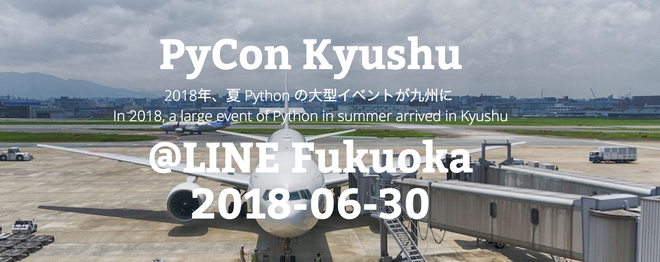

============================
PyCon Kyushuについて
============================

PyCon JP 2017年の懇親会にて九州出身参加者が九州でもPyConをやりたいという思いで、実行委員会を発足し、約10ヶ月の準備期間を経て開催するに至りました。

イベント時期は、博多の祇園祭が開催される時期で、街を歩くと多くの山車を見ることができました。そんな博多を皮切りに、PyCon Kyushuを開催することにしました。

最初は、数人のメンバーで始まりましたが、時を経るにつれてメンバーが増えて行きました。不安の中なのスタートでしたが、徐々に仲間が増えると共に活気が増してきました。PyCon Kyushuは、実行委員会形式で行うイベントで、ボランティアで実行委員もチケットを購入するルールで行いました。ですので、実行委員メンバーには、負担がないように係や役割を明確にして、分担してイベントまでの準備をしました。

イベントまでには、多くのことを行います。予算を組んだり、会場を押さえたり、キーノートを決めたり、イベントの内容を考えて決めたり、登壇者を募ったり、スポンサーとの対応をしたり、チケット販売や管理をしたり、会場の設営や閉じつスタッフの手配、その他にも数多くの作業があります。

MTGは、主にconnpassを使って管理をしました。
https://pycon-kyushu.connpass.com/

また、Googleのドライブやドキュメント、trelloを使ってプロジェクトを管理しました。また、実行委員メンバーの所属する会社の会議室を借りて、月一回の全体MTGや係りごとのMTGなど、色々な協力者にも恵まれ、何とかイベントまでこぎつけました。

当日は、雨が振りましたが、会場のLINE福岡はJR博多駅から近く便利な場所にあったので、非常に助かりました。そして、200名以上の参加者イベントは開催されました。
