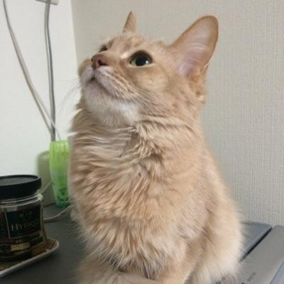

==============
執筆者
==============

| **清田 史和 (清田 史和)**
| **Fumikazu Kiyota**
| PyCon JP 2012-2016実行員で、最近は、地元の九州でのPythonの普及活動
| `SnapDish <https://snapdish.co>`_ サービス開発を手がけている
| `Vuzz Inc. <http://vuzz.com>`_ 取締役CTO
| `株式会社ナチュラルコーヒー <http://natural.coffee>`_ 代表取締役
| `学校法人北部学園ほくぶ幼稚園 <http://hokugaku.com>`_ 理事長

| **massyuu (マシュー)**
| PyCon Kyushu 2018実行員。バックエンドエンジニア。鶏の唐揚げLOVE。
| 最近は育児をしつつ、面白いサービスを生み出そうと日々奮闘中。
| WEB上では `massyuu <https://twitter.com/mass_ssn>`_ や「唐揚げエンジニャー」などと名乗っている。

| **Intel0tw5727**
| Univ. of the Ryukyus Dept. of I.E.
| Fav: Deep Learning, Image Processing, Natural Language Processing 
| Like: Python, pandas
| `Github <https://github.com/Intel0tw5727>`_ 

| **James Cannon**
| I am a project associate professor within the Mechanical Engineering department at Kyushu University (Fukuoka, Japan) and deputy-director of the International Education Support Centre for Engineering. My position allows me to combine research into nano-scale thermo-physical properties of liquids and solids with my interests in modern teaching methods and internationalisation.
| `www.jamescannon.net <http://www.jamescannon.net/>`_ 
